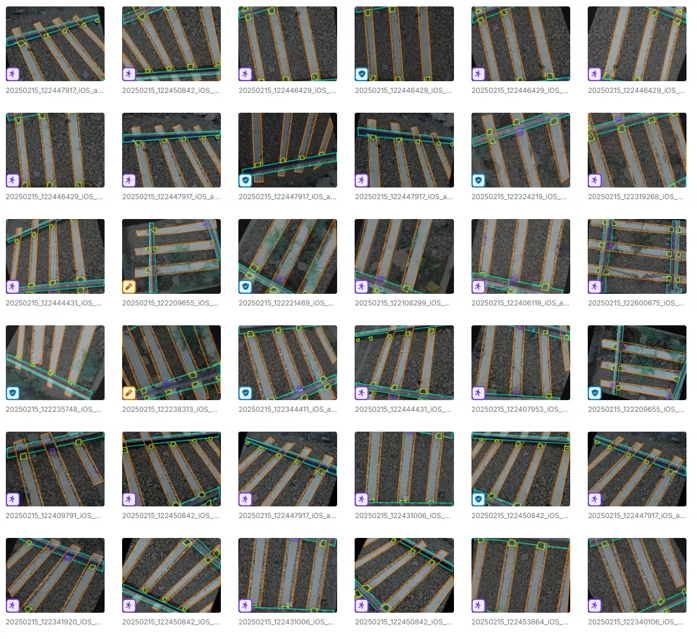
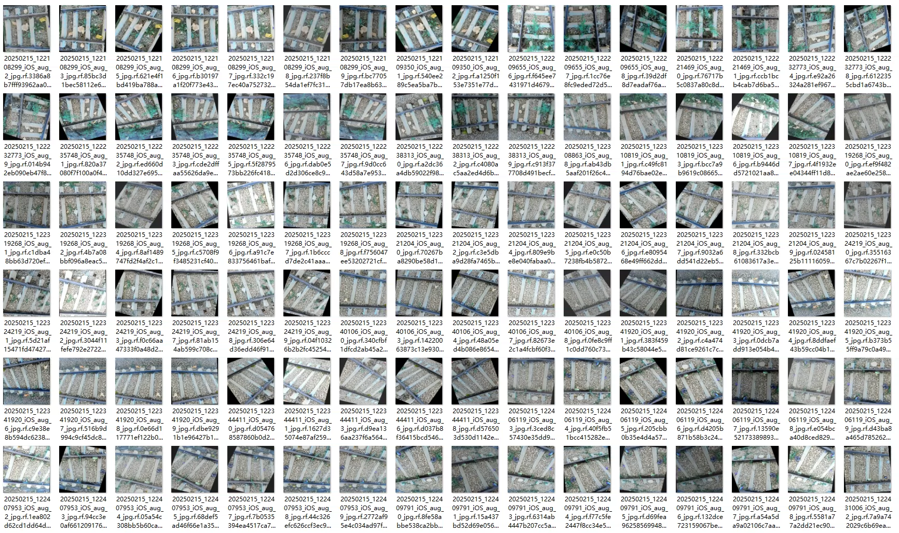
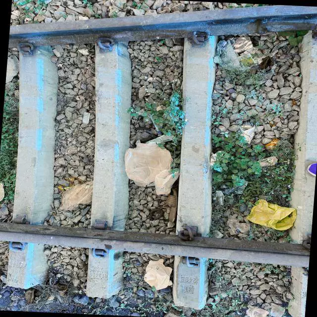
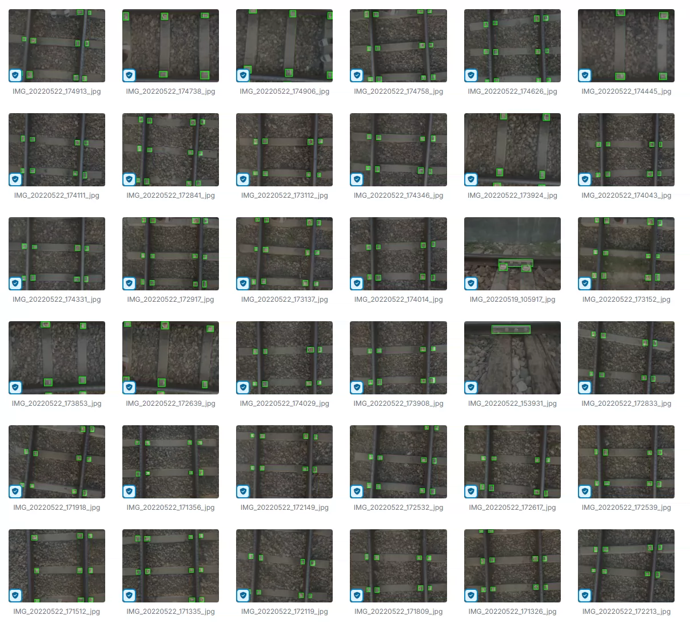
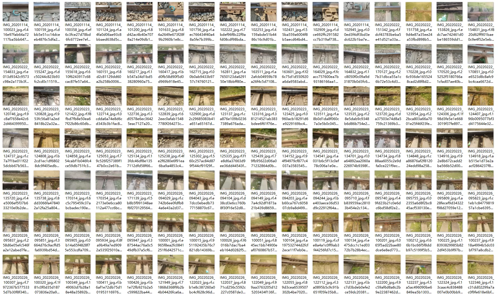
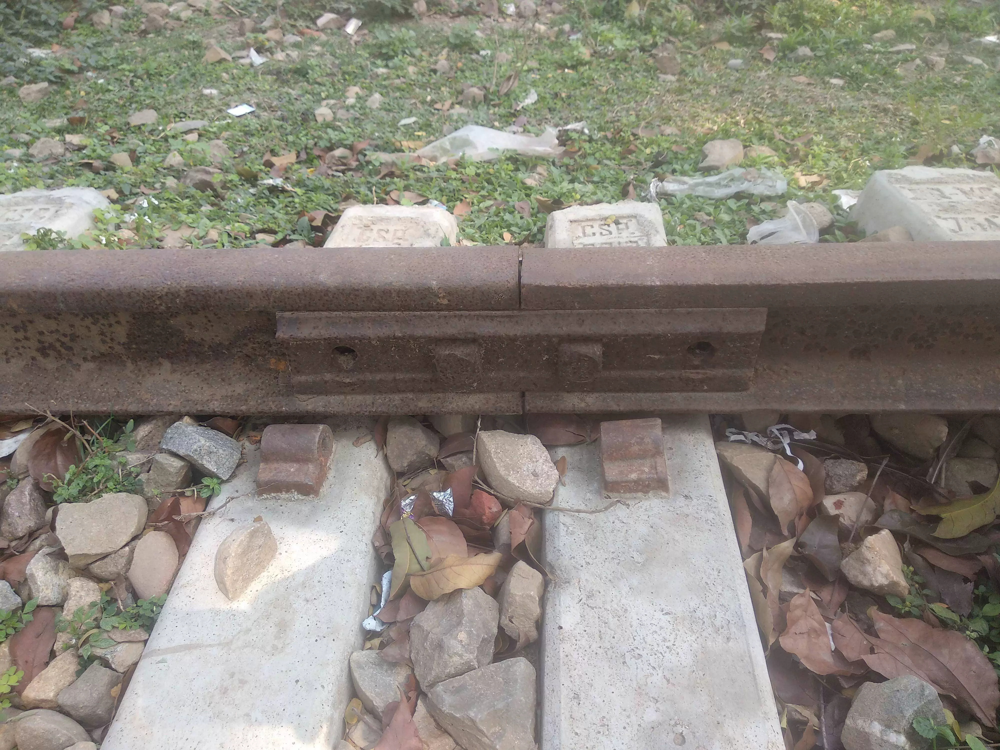

## Body

The railway rail image recognition dataset consists of two datasets.

There are a total of 1,000 images, each labeled with its corresponding category. The categories are divided into five types: 'fastener', 'missing fastener', 'obstacle', 'railway track', and 'sleeper'.

There are also 2,000 images, each labeled with its corresponding category. The categories are divided into four types: 'defective fishplate', 'fastener', 'missing fastener', and 'non defective fishplate'.

Electronic virtual products sold are non-refundable.

## Images

item_1032987954485

Here is a pay link on Stripe ( https://buy.stripe.com/3cs8yP7sY87d0vu9AB ). Please contact me lonlonago@foxmail.com after funding $89, and I will send you a complete data files , thank you!

